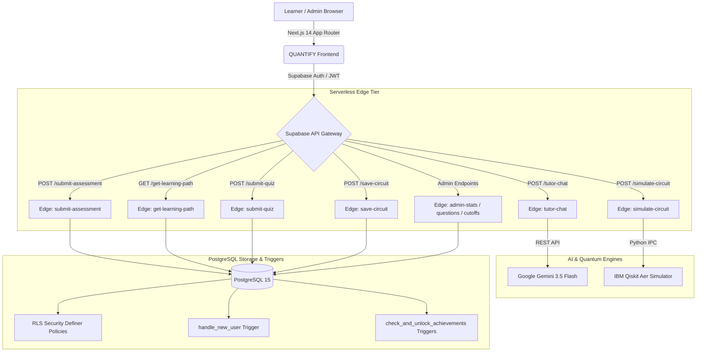

# ⚛️ QUANTIFY — AI-Powered Quantum Science Adaptive Learning Platform

<div align="center">

[](https://nextjs.org/)
[](https://www.typescriptlang.org/)
[](https://supabase.com/)
[](https://www.postgresql.org/)
[](https://qiskit.org/)
[](https://deepmind.google/technologies/gemini/)
[](https://tailwindcss.com/)
[](https://opensource.org/licenses/MIT)

<p align="center">
  <b>Smart India Hackathon (SIH 2026) — Problem Statement ID: SIH26140</b><br>
  <i>An AI-driven adaptive quantum computing ecosystem bridging the gap from fundamental linear algebra to executing real quantum algorithms on Qiskit Aer.</i>
</p>

[Explore Live Demo](http://localhost:3000) • [Architecture](#-system-architecture) • [Edge Functions](#-live-supabase-edge-functions-10) • [Database Schema](#-database-schema--triggers) • [Authors](#-authors--collaborators)

</div>

---

## 🌌 Overview

**QUANTIFY** is a next-generation quantum computing education ecosystem engineered for undergraduate learners, educators, and quantum researchers. Traditional quantum pedagogy suffers from steep mathematical cliffs and disconnected simulation tools. QUANTIFY solves this by combining:

1. **Zero-Trust Diagnostic Assessment**: Multi-concept baseline evaluation that automatically maps student strengths and weakness vectors.
2. **Adaptive Personalized Roadmaps**: Dynamic curriculum sequencing that elevates weak concepts into *Priority Revision* tracks.
3. **Interactive Quantum Circuit Simulator**: Full multi-qubit canvas with statevector calculations, basis-state measurement probabilities, and cloud **IBM Qiskit Aer** execution.
4. **Quanta AI Tutor**: Real-time conversational quantum mentor powered by **Google Gemini AI**, delivering Socratic guidance, LaTeX proofs, and runnable Python snippets.
5. **Gamified Accolades & Accreditations**: Automated PostgreSQL trigger engine evaluating milestones, 7-day streaks, and algorithm masteries.
6. **Executive Admin Telemetry**: Live admin portal with diagnostic cutoff configuration, question bank CRUD, and real-time learner proficiency distributions.

---

## 🏛️ System Architecture



---

## ⚡ Live Supabase Edge Functions (10)

All 10 production Edge Functions are deployed live to project `lpegmwrbdixvwwjfhhuo`:

| # | Function Endpoint | Runtime | Description |
|---|---|---|---|
| 1 | `submit-assessment` | Deno / TS | Zero-trust diagnostic grading across 5 categories; assigns beginner/intermediate/advanced tiers. |
| 2 | `get-learning-path` | Deno / TS | Computes personalized curriculum sequencing with weak-area priority sorting. |
| 3 | `submit-quiz` | Deno / TS | Evaluates topic quizzes, updates learner quiz averages, and marks modules completed. |
| 4 | `tutor-chat` | Deno / TS | Direct Gemini 3.5 Flash integration with LaTeX formula formatting and Qiskit code examples. |
| 5 | `save-circuit` | Deno / TS | Persists circuit wire topologies, gate sequences, and measurement outcomes. |
| 6 | `get-my-circuits` | Deno / TS | Fetches user-created circuits and platform algorithms (Bell State, Grover, Deutsch-Jozsa). |
| 7 | `simulate-circuit` | Python / Deno | Multi-qubit circuit simulation backed by Python Qiskit Aer generating Statevectors & OpenQASM 2.0. |
| 8 | `admin-stats` | Deno / TS | Admin telemetry: active learners, diagnostic averages, and category diagnostic breakdowns. |
| 9 | `admin-questions-crud` | Deno / TS | Full administrative CRUD management (Create, Read, Update, Delete) for diagnostic questions. |
| 10 | `admin-cutoffs` | Deno / TS | Configures platform proficiency tier cutoff score boundaries (`beginnerMax`, `intermediateMax`). |

---

## 🗄️ Database Schema & Triggers

QUANTIFY runs on a secure, production-grade PostgreSQL instance featuring **Row Level Security (RLS)** on every table:

### Core Tables
- `public.profiles`: Learner telemetry, diagnostic level, streaks, quiz averages, weak/strong vectors, and unlocked badges.
- `public.assessment_questions`: Multi-concept diagnostic questions with JSONB options.
- `public.assessment_attempts`: Audit trail of diagnostic attempts and category breakdowns.
- `public.topics`: 13 comprehensive quantum modules spanning Basics, Qubits, Gates, Circuits, and Algorithms.
- `public.quiz_questions` & `public.quiz_attempts`: Post-module checkpoint testing with server verification.
- `public.saved_circuits`: Serialized circuit layouts, target qubits, gate types, and simulation results.
- `public.tutor_conversations` & `public.tutor_messages`: Quanta AI chat session history with hint toggles.
- `public.resources` & `public.books`: Curated textbooks and multimedia learning library.
- `public.achievements` & `public.user_achievements`: Master badge catalog and learner progress logs.
- `public.platform_settings`: Dynamic score threshold configurations for diagnostic tiering.

### Automated Trigger Systems
- **`handle_new_user()`**: Listens on `auth.users` to automatically provision a learner profile initialized with DEFAULT_USER values on signup.
- **`check_and_unlock_achievements()`**: Evaluates 8 distinct badge criteria automatically whenever an assessment is taken, a quiz is passed, a streak updates, a circuit is saved, or an AI question is asked. Includes built-in anti-recursion safeguards.

---

## 💻 Tech Stack

- **Frontend**: [Next.js 14](https://nextjs.org/) (App Router), [React 18](https://react.dev/), [TypeScript](https://www.typescriptlang.org/)
- **Styling & Design**: [Tailwind CSS](https://tailwindcss.com/), Glassmorphism, [Lucide Icons](https://lucide.dev/), [Recharts](https://recharts.org/)
- **Backend & Database**: [Supabase](https://supabase.com/) (PostgreSQL 15, Auth, Row Level Security)
- **Serverless Tier**: Supabase Edge Functions (Deno runtime)
- **Quantum Backend**: [IBM Qiskit Aer](https://qiskit.org/) (Statevector, Basis Measurement, OpenQASM 2.0)
- **AI Mentor**: [Google Gemini 3.5 Flash](https://deepmind.google/technologies/gemini/) (Socratic tutoring, LaTeX math)

---

## 🚀 Quick Start Guide

### Prerequisites
- [Node.js](https://nodejs.org/) (v18.17 or later)
- `npm` or `pnpm`

### 1. Clone the Repository
```bash
git clone https://github.com/K1avya/SIH_2026_79.git
cd SIH_2026_79
```

### 2. Install Dependencies
```bash
npm install
```

### 3. Configure Environment Variables
Create `.env.local` in the project root:
```env
NEXT_PUBLIC_SUPABASE_URL=https://lpegmwrbdixvwwjfhhuo.supabase.co
NEXT_PUBLIC_SUPABASE_ANON_KEY=your-supabase-anon-key
NEXT_PUBLIC_API_BASE_URL=https://lpegmwrbdixvwwjfhhuo.supabase.co/functions/v1
GEMINI_API_KEY=your-gemini-api-key
```

### 4. Launch Local Development Server
```bash
npm run dev
```
Open **[http://localhost:3000](http://localhost:3000)** in your browser.

### 5. Production Build Check
```bash
npm run build
```

---

## 📂 Project Directory Layout

```
├── app/                        # Next.js App Router (17 static & dynamic routes)
│   ├── achievements/           # Gamified accolades and unlock progress
│   ├── admin/                  # Telemetry, question CRUD, and cutoffs portal
│   ├── assessment/             # Zero-trust diagnostic assessment evaluation
│   ├── books/                  # Curated textbooks with diagnostic recommendations
│   ├── dashboard/              # Dynamic roadmap progress, metrics, & charts
│   ├── login/                  # Supabase authentication portal
│   ├── path/                   # Adaptive personalized learning roadmap
│   ├── quiz/[id]/              # Post-module checkpoint quizzes
│   ├── resources/              # Research papers, notebooks, and lecture hub
│   ├── simulator/              # Interactive quantum circuit simulator & Qiskit
│   ├── topic/[id]/             # Theory, formulas, Bloch sphere visuals, and video
│   └── tutor/                  # Quanta AI conversational mentor (Gemini 3.5)
├── backend/                    # Database migrations & Serverless backends
│   ├── achievements_trigger.sql# Automated badge unlock trigger & rules
│   ├── auth_trigger.sql        # Automated learner profile provisioning
│   ├── rls_policies.sql        # Row Level Security & is_admin() checks
│   ├── rpc_functions.sql       # Postgres RPC stored procedures
│   ├── schema.sql              # 15 core PostgreSQL tables & indexes
│   ├── seed.sql                # Complete curriculum & resource datasets
│   ├── qiskit_simulator.py     # Python Qiskit Aer simulation engine
│   └── functions/              # 10 Supabase Edge Function source implementations
├── components/                 # Reusable quantum design system components
│   ├── layout/AppShell.tsx     # Responsive quantum navigation sidebar & header
│   └── ui/                     # Accessible empty & loading state primitives
├── lib/
│   ├── api/                    # Typed API client wrappers for Edge Functions
│   ├── auth-context.tsx        # Supabase Auth provider & session sync
│   └── quantum-simulator.ts    # Client-side quantum matrix simulator engine
├── supabase/                   # Supabase CLI deployment entrypoints
└── types/quantify.ts           # Central domain interfaces & data types
```

---

## 👥 Authors & Collaborators

Proudly designed and developed for the **Smart India Hackathon (SIH 2026)**:

<div align="center">

| Avatar | Collaborator | Role & Contribution | Profile |
| :---: | :--- | :--- | :---: |
| 🚀 | **Daksh Prajapati** | **Full-Stack Architecture & Backend Engineering**<br>• Designed & deployed all 10 Supabase Edge Functions<br>• Implemented PostgreSQL schema, RLS policies, & achievement triggers<br>• Integrated Python Qiskit Aer & Google Gemini AI Tutor | [@DAKSH-9572](https://github.com/DAKSH-9572) |
| ⚛️ | **Kavya Chandegara** | **Project Lead & Frontend Engineering**<br>• System architecture & component design<br>• Interactive Quantum Circuit Simulator UI & AppShell<br>• Git repository coordinator & deployment manager | [@K1avya](https://github.com/K1avya) |
| 📚 | **Dhruv Chaudhary** | **Quantum Content & Educational Engineering**<br>• Curated diagnostic question bank & checkpoint quizzes<br>• Formulated mathematical foundations & textbook recommendations<br>• Quantum Resource Library curation | [@mrdhruv18](https://github.com/mrdhruv18) |

</div>

### 🏅 Acknowledgments
- **Ministry of Education, Government of India** — For organizing the Smart India Hackathon.
- **IBM Quantum / Qiskit Community** — For providing state-of-the-art open-source quantum simulation tools.
- **Google DeepMind** — For the Gemini API powering our conversational quantum tutor.

---

<div align="center">
  <sub>Built with ⚛️ for the quantum computing pioneers of tomorrow.</sub>
</div>
